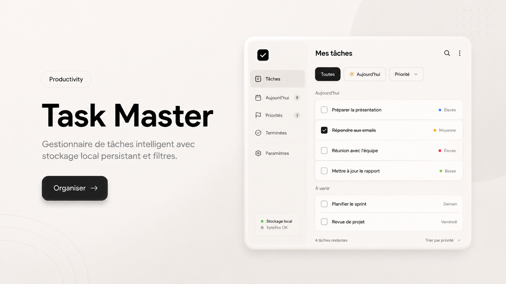

# 🚀 Task Master — Gestionnaire de tâches intelligent & Premium

> Une interface de productivité haute performance inspirée des standards "Quiet Luxury", avec une gestion avancée des priorités, du filtrage temporel et une persistance locale robuste.



---

## 📖 Description

**Task Master** n'est pas une simple "to-do list". C'est un tableau de bord de productivité conçu pour offrir une expérience utilisateur fluide et sans friction. L'application met l'accent sur la hiérarchisation des tâches et la clarté visuelle.

### Objectifs atteints
- **UI/UX Premium** : Design neumorphique léger, typographie Inter, et mise en page structurée.
- **Gestion Métier** : Système de priorités (Élevée, Moyenne, Basse) et organisation temporelle (Aujourd'hui, À venir).
- **Zéro Dépendance** : Développé en HTML5, CSS3 et JavaScript Vanilla.

---

## ✨ Fonctionnalités Clés

- 📊 **Tableau de Bord Holistique** : Vue d'ensemble des tâches par catégories (Aujourd'hui, Priorités, Terminées).
- 🚩 **Gestion des Priorités** : Indicateurs colorés pour identifier instantanément les urgences.
- 🗓️ **Planification Temporelle** : Séparation intelligente entre les tâches du jour et les échéances futures.
- 💾 **Persistance Locale** : Sauvegarde automatique de l'état applicatif via `localStorage`.
- 📱 **Responsive Design** : Interface optimisée pour desktop et mobile avec sidebar escamotable.

---

## 🛠️ Stack Technique

| Composant | Technologie |
|-----------|-------------|
| **Structure** | HTML5 Sémantique |
| **Style** | CSS3 (Variables, Flexbox, Backdrop-filters) |
| **Logique** | JavaScript ES6+ (State management, DOM Rendering) |
| **Persistance** | LocalStorage API |
| **Icônes** | Font Awesome 6 |

---

## 🏗️ Architecture Technique

```
todo-list/
├── index.html    # Layout complexe avec Sidebar & Main Content
├── style.css     # Design System (Tokens, Neumorphism, Animations)
├── script.js     # Logique d'état, filtrage dynamique & persistance
└── README.md     # Documentation
```

### Modèle de Données
```javascript
{
  id: 1678569706902,
  text: "Finaliser le rapport annuel",
  priority: "high",    // high, medium, low, none
  date: "today",       // today, tomorrow, friday, later
  completed: false
}
```

---

## ⚙️ Logique de Filtrage

L'application utilise un moteur de filtrage dynamique basé sur l'état des tâches :

```javascript
function renderTasks(filter = 'all') {
    let filteredTasks = tasks;
    if (filter === 'today') filteredTasks = tasks.filter(t => t.date === 'today');
    if (filter === 'priorities') filteredTasks = tasks.filter(t => t.priority !== 'none');
    if (filter === 'completed') filteredTasks = tasks.filter(t => t.completed);
    // ... rendu dynamique
}
```

---

## 👤 Auteur

**Soufiane EL RHADI**
Développeur Web Full-Stack

> Projet réalisé pour démontrer la capacité à transformer un concept visuel haute fidélité (Mockup) en une application web interactive et fonctionnelle, tout en respectant une logique métier rigoureuse.

[](../../index.html)
